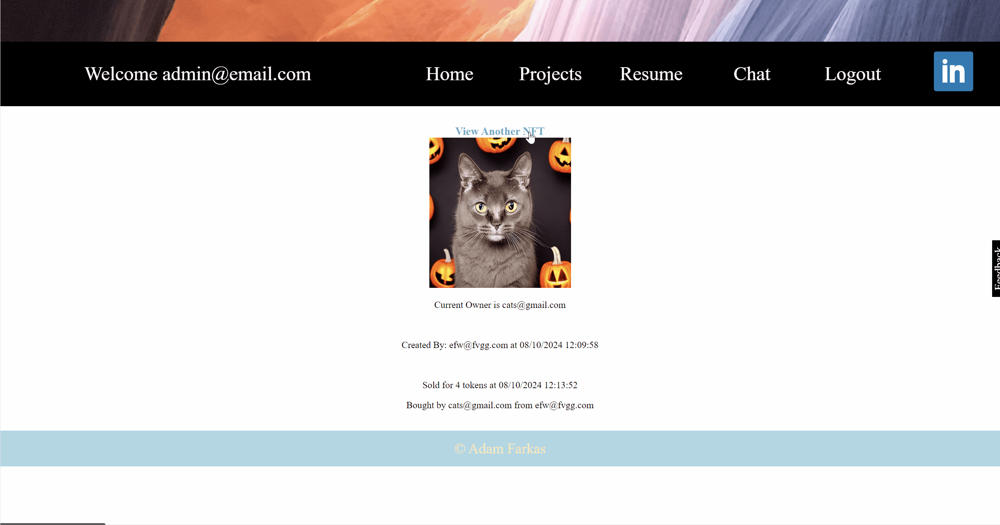

# Cat-Image-Marketplace-Snippet

A web-based cat image marketplace leveraging HTML, JavaScript, and CSS for the front-end to create a user-friendly and visually appealing interface. To dynamically render HTML content based on user-specific data, I utilized Jinja templates within Flask. On the back-end, I implemented a robust system using Python and Flask, which facilitated user logins, image uploads, and comprehensive database management for cat image listings and exchanges. Additionally, I integrated a blockchain approach to ensure the security and integrity of transactions and image ownership, enhancing the overall reliability and trustworthiness of the marketplace.

Check out these code snippets and application GIFs demonstrating the Cat Image Marketplace in action!
   

## Cat Image Marketplace Demo

## Cat Image Blockchain Demo

